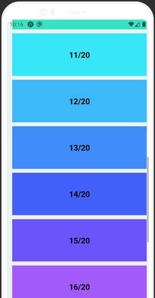

<h1 align="center">
  <!-- <br/> -->
  pagescrollview
</h1>

<div align="center">

[](http://makeapullrequest.com)
[](http://www.typescriptlang.org/)
[](https://www.npmjs.com/package/pagescrollview)
[](https://www.npmjs.com/package/pagescrollview)
</div>

React Native ScrollView component interface that fills all the available area and has a working scrolling (!).

It fixes some very common issues with ScrollView: [1](https://github.com/facebook/react-native/issues/4099#issuecomment-307541206), [2](https://stackoverflow.com/questions/34880660/react-native-children-of-scrollview-wont-fill-full-height), [3](https://stackoverflow.com/questions/46805135/scrollview-with-flex-1-makes-it-un-scrollable), [4](https://github.com/facebook/react-native/issues/3825)

### 2.0.0! - 2022-06-17
It now uses a FlatList instead of the ScrollView under the hoods, as [FlatLists/SectionLists aren't allowed inside a ScrollView](https://stackoverflow.com/q/58243680/10247962). This doesn't change other behaviors or performance.


It also includes those commonly used props as default:

* `keyboardShouldPersistTaps='handled'` - [Allows pressing pressables when Keyboard is open. Pressing a non-pressable area will dismiss the keyboard.](https://stackoverflow.com/a/57941568/10247962) - [You will still need to Keyboard.dismiss() to hide the keyboard when pressing a pressable.](https://stackoverflow.com/a/39772206/10247962)
* `overScrollMode='never'` - Won't allow over scrolling in Android.
* `nestedScrollEnabled={true}` - Allows nested scrolling in Android.

**Compatible with Web and Expo.**


## 💿 Installation
```bash
npm install pagescrollview
# or
yarn add pagescrollview
```

<details>
<summary><b>You may be instead interested in a simplified code version</b></summary>

```tsx
import type { ScrollViewProps, StyleProp, ViewStyle } from 'react-native';
import { ScrollView, StyleSheet, View } from 'react-native';


export type PageScrollViewProps = ScrollViewProps & {
  /** The style of the inner view, where your children will be.
   *
   * You will usually use this to apply the styles, such as the `backgroundColor` and `paddings`. */
  viewStyle?: StyleProp<ViewStyle>;
};

/** React Native's ScrollView has some bugs on its sizing and scroll (
 * [1](https://github.com/facebook/react-native/issues/4099#issuecomment-307541206),
 * [2](https://stackoverflow.com/questions/34880660/react-native-children-of-scrollview-wont-fill-full-height),
 * [3](https://stackoverflow.com/questions/46805135/scrollview-with-flex-1-makes-it-un-scrollable),
 * [4](https://github.com/facebook/react-native/issues/3825)
 * ).
 *
 * This fixes them.
 *
 * This is a simplified component of the [pagescrollview package](https://github.com/SrBrahma/pagescrollview)
 */
export function PageScrollView({
  contentContainerStyle,
  children,
  viewStyle,
  ...rest
}: PageScrollViewProps): JSX.Element {
  return (<ScrollView
    bounces={false}
    overScrollMode='never'
    keyboardShouldPersistTaps='handled'
    contentContainerStyle={[styles.container, contentContainerStyle]}
    nestedScrollEnabled
    {...rest}
  >
    <View style={[styles.view, viewStyle]}>
      {children}
    </View>
  </ScrollView>
  );
}


const styles = StyleSheet.create({
  container: {
    // https://github.com/facebook/react-native/issues/4099#issuecomment-307541206
    // If using flex: 1, the screen would fill everything as intended, but the scroll wouldn't work.
    flexGrow: 1,
  },
  view: {
    flex: 1,
  },
});
```

</details>

## 📖 Usage

> The usage is exactly how you would use the ScrollView, with the few extra optional props listed in the [Type section below](#type), without having to deal with the said bugs above! This example is just to have something pretty in this readme!

```tsx
import React from 'react';
import { StyleSheet, Text, View } from 'react-native';
import { PageScrollView } from 'pagescrollview'

const items = 20;

export default () => {
  return (
    <PageScrollView backgroundColor='#ebf3f3' style={styles.style}>
      {[...Array(items)].map((_,i) => {
        const backgroundColor = `hsl(${Math.floor((360/items)*i)}, 90%, 62%)`
        return (<View key={i} style={[styles.itemView, { backgroundColor }]}>
          <Text style={styles.itemText}>{`${i+1}/${items}`}</Text>
        </View>)
      })}
    </PageScrollView>
  );
}

const styles = StyleSheet.create({
  style: {
    padding: 10,
  },
  itemView: {
    width: '100%',
    margin: 5,
    padding: 40,
  },
  itemText: {
    textAlign: 'center',
    fontSize: 20,
    fontWeight: 'bold'
  }
});
```



### 🍟 [Snack of the code above](https://snack.expo.io/@srbrahma/887706)
<!-- also in https://expo.io/@srbrahma/pagescrollview but snack seems better -->
## Type
```ts
export type PageScrollViewProps = Omit<FlatListProps,
  'ListFooterComponentStyle' | 'ListFooterComponent' | 'data' | 'renderItem' | 'keyExtractor'
> & {
  /** Use this to change the backgroundColor. Internally, it changes FlatList's `style` and `ListFooterComponentStyle`.
   *
   * We change `style` to have backgroundColor when iOS users overscroll with `bounces`. */
  backgroundColor?: string;
};
```
## 📰 [Changelog](CHANGELOG.md)
